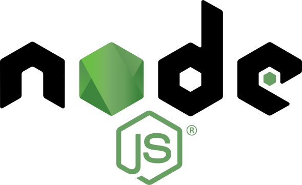

# Yahtzee-Online
  
  

<br>
<br>

A Mongoose Express React Node Server App using Typescript, Firebase Auth and Hooks for an online version of the popular dice game

<br>


## Prerequisites

<a href="https://nodejs.org/en/"></a>
<!-- <a href=""></a> -->

## Installation

```bash
npm i
```

## Usage

```bash
npm run start
```

## Running Tests

```bash
npm run test
```

## Deployment

https://yahtzee-react-app.herokuapp.com/

## Authors

[Jon Jackson](http://github.com/ocskier)

Please make sure to update tests as appropriate.

## License

MIT

